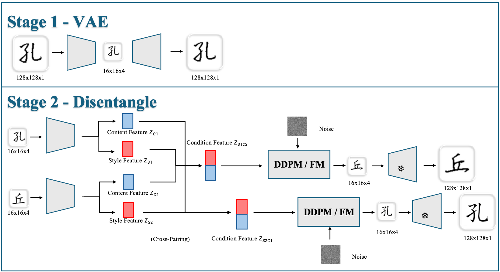
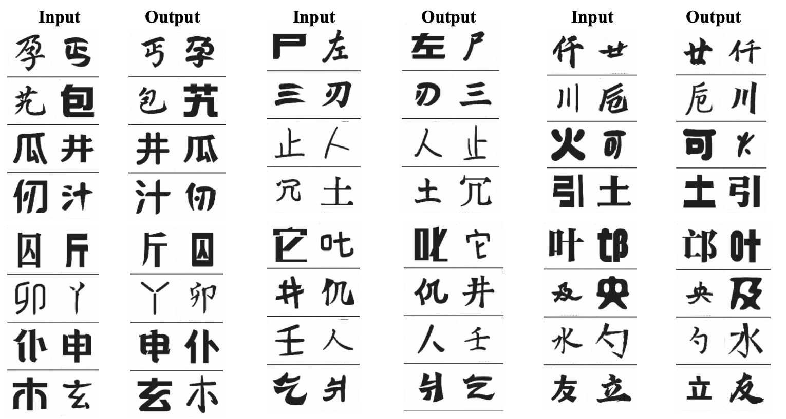
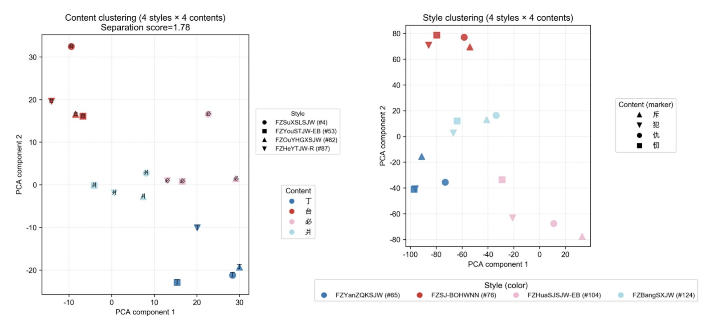
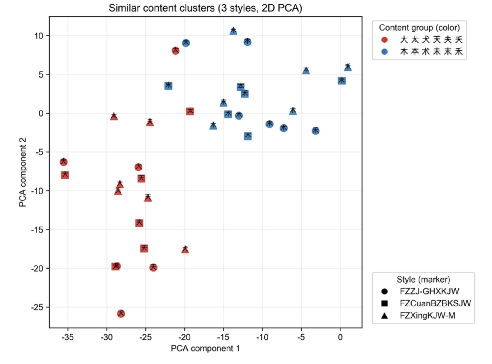
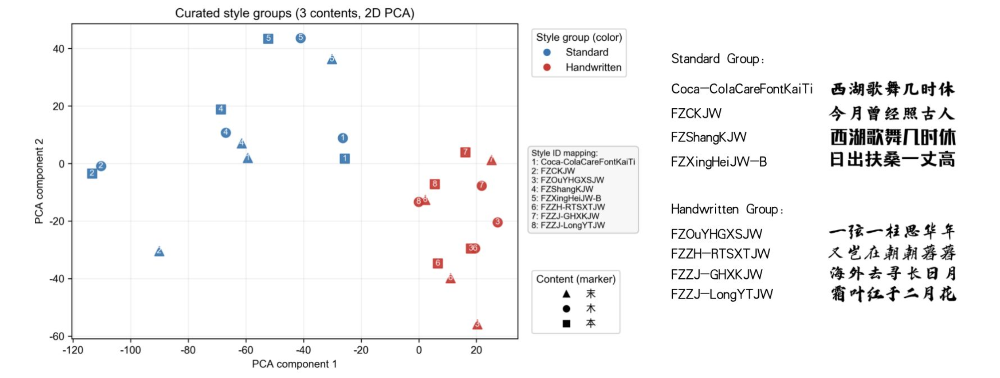
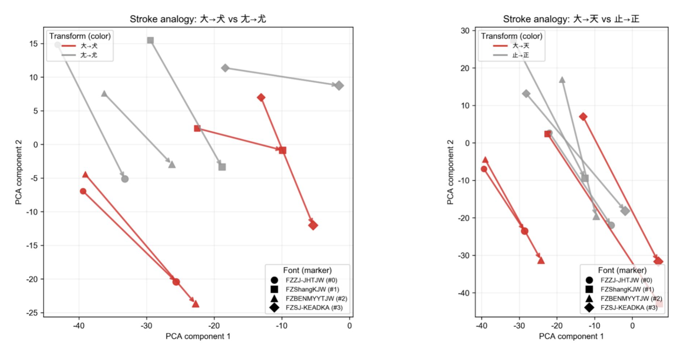

# Content–Style Disentangled Representation Learning for Chinese Font Generation

We proposes a scalable architecture-agnostic framework that clearly separates glyph structure (content) and stylistic attributes (style) into two independent latent spaces. 

---

## 1. Overview



This repository implements a two-stage generative pipeline:

1) **Stage 1 – VAE**: Compress 128×128 grayscale glyphs into compact latents (16x16x4).  
2) **Stage 2 – Disentanglement**: Learn separate content (Zc) and style (Zs) latent spaces using cross-pairing, MCL adversarial loss, SCCR/CCR contrastive regularization, and either DDPM or Flow Matching denoising. The design is architecture-agnostic and works with [MAR](https://github.com/LTH14/mar) (MLP AdaLN), [UNet](https://github.com/CompVis/latent-diffusion) (LDM-style), and Patch/Transformer UNet-Pro.

---

## 2. QuickStart

```bash
# 1) Train VAE (config.yaml with train_stage: VAE)
python main_train.py

# 2) Extract latents (pt or lmdb)
python inference/VAE_inference.py --mode pt

# 3) Train disentanglement model (config.yaml with train_stage: disentangle_mar / disentangle_sd / disentangle_sd_pro)
python main_train.py   
```


---

## 3. Core Ideas

- **Latent abstraction via VAE**  
  High-resolution glyphs are compressed into a compact latent manifold (16×16×4), enabling efficient training while preserving structural semantics.

- **Cross-pairing for disentanglement**  
  Four-way pairing (F_A+C_A, F_A+C_B, F_B+C_A, F_B+C_B) enforces that content and style must become orthogonal factors that can be recombined arbitrarily.

- **Explicit separation through targeted regularization**  
  MCL adversarial classifiers remove unwanted content/style leakage, while SCCR/CCR contrastive losses align positive pairs and repel negatives, sharpening Zc/Zs boundaries.

- **Conditional generative modeling in latent space**  
  A diffusion or flow-matching denoiser reconstructs the clean latent from noise conditioned on (Zc, Zs), enabling controllable synthesis and high-fidelity generation.

- **Architecture-agnostic design**  
  The entire disentanglement strategy applies uniformly across MLP-based (AdaLN), convolutional (UNet), and patch/transformer hybrids (UNet-Pro), demonstrating the generality of the approach.


---

## 4. Repository Structure

```
Content-Style-Disentangled-Representation-Learning/
├── configs/            # Ready-to-run YAML presets for every stage algo combo
├── trainer/            # Training harnesses, hooks, EMA/scheduler utilities
├── dataset/            # Glyph rendering helpers, LMDB/PT datasets, latent stats
├── models/             # VAE enc/dec, diffusion/FM backbones, Siamese heads
├── inference/          # Stage-1 latent dumping, shard merge, sanity checks
├── utils/              # Metrics, logging, visualization, LR helpers
├── font_gen.py         # CLI for turning .ttf + charset list into datasets
├── main_train.py       # Switches between VAE/disentangle experiments via configs
├── checkpoints/        # Pretrained weights + run outputs
└── final_codebooks/    # Saved content/style dictionaries for sampling
```

**Quick orientation**
- Configs + `main_train.py`/`trainer/` define experiments (`train_stage` toggles VAE vs. disentangle).
- `dataset/`, `font_gen.py`, and `inference/` cover the end-to-end data flow: render glyphs → package latents → compute stats.
- `models/` and `utils/` contain the reusable building blocks that implement the disentanglement strategy.

---

## 5. Environment

- Python ≥ 3.9  
- PyTorch ≥ 1.12 (CUDA optional but recommended)  

To install all dependencies, simply run:

```bash
pip install -r requirements.txt
```

---

## 6. Data Preparation

To obtain `.ttf` font files, the [FounderType (方正字库)](https://www.foundertype.com/) library provides a wide selection of high-quality Chinese fonts suitable for training.


1) **Fonts & charset**  
```
fonts/
  FontA.ttf
  FontB.ttf
char_list.txt   # one character per line
```

2) **Render glyph dataset (PNG or LMDB)**  
```bash
python font_gen.py \
  --fonts fonts/ \
  --char_list char_list.txt \
  --output data/ \
  --use_lmdb --lmdb_path font_data.lmdb
```

---

## 7. Stage 1 — VAE Training & Latent Extraction

Train the VAE encoder–decoder to obtain compact latent representations.  
LMDB storage is recommended for stability and faster random access.

- Config file: `configs/config.yaml`
- Output: `checkpoints/vae_best_ckpt.pth` (plus optional wandb logs)

```bash
python main_train.py   # or --mode lmdb
```
After training, use the VAE encoder to convert 128×128x1 glyphs into latents:

```bash
python inference/VAE_inference.py --mode pt   # or --mode lmdb
```

Outputs: `font_latents_*.pt` or `font_latents_*.lmdb` (used directly in Stage 2). Paths are configurable at the top of the script.

Don't forget to compute latent statistics for diffusion/flow-matching normalization:

```bash
python dataset/compute_latent_stats.py --lmdb font_latents_*.lmdb --shape 4 16 16
```

---

## 8. Stage 2 — Disentanglement Training

- Entrypoints: `main_train.py` (config.yaml).
- Architectural Backbones:  
  - `disentangle_mar` – MLP AdaLN + DDPM/FM.  
  - `disentangle_sd` – Light UNet (LDM-style).  
  - `disentangle_sd_pro` – Patch/Transformer UNet.  
  - `disentangle_regression` – baseline MLP denoising/regression.  
- Important flags:  
  - `algo.type`: `ddpm` | `flow_matching`  
  - `contrastive.enable`, `lambda`, style/content weights, `tau`, `detach`  
  - `adv.enable` for MCL adversarial classifiers  
  - `train.cfg` for classifier-free guidance (drop prob & scale)  
  - `vis.enable` to decode samples with VAE  
  - `wandb.enable` for logging  
```bash
python main_train.py   # set train_stage: disentangle_mar / disentangle_sd / disentangle_sd_pro
```

---

## 9. Evaluation

- **Pixel metrics**: PSNR, SSIM, L1/L2 reconstruction (`utils/evaluate_basic.py`).  
- **Content/Style Siamese metrics**: `utils/siamese_scores.py`; checkpoints in `checkpoints/content_*`, `checkpoints/style_*`.
To train your own Siamese backbone for custom evaluation:

```bash
python trainer/train_siamese_metrics.py  
```

---

## 10. Results

We summarize the key findings as follows:

- **Flow Matching (FM)** consistently outperforms **DDPM** across all architectures.  
- **UNet-FM** achieves the best reconstruction fidelity, though it trains more slowly.  
- **MAR-FM** offers the best balance between speed, stability, and generalization.  
- **Siamese-based metrics** provide the most reliable assessment of disentanglement quality.

### Qualitative examples



---

### Architecture & Scheduler Comparison

| Model         | L1 ↓     | L2 ↓     | PSNR ↑     | SSIM ↑    | C-Score ↑ | S-Score ↑ |
|--------------|-----------|-----------|-------------|-----------|------------|------------|
| **MAR-FM**        | 0.0359    | 0.0295    | 15.5569     | 0.8942    | 0.9794     | 0.9808     |
| MAR-DDPM      | 0.0710    | 0.0582    | 12.6754     | 0.8012    | 0.8495     | 0.5703     |
| **UNet-FM**       | **0.0126** | **0.0072** | **21.5819** | **0.9487** | **1.0000** | **1.0000** |
| UNet-DDPM     | 0.0828    | 0.0734    | 11.6415     | 0.8018    | 0.9669     | 0.5010     |
| UNet-Pro-FM   | 0.1036    | 0.0937    | 10.4966     | 0.7760    | 0.9419     | 0.7453     |
| UNet-Pro-DDPM | 0.1315    | 0.1234    |  9.3496     | 0.7652    | 0.9705     | 0.3508     |

---

### MCL / SCCR Ablation

| Model        | L1 ↓     | L2 ↓     | PSNR ↑     | SSIM ↑    | C-Score ↑ | S-Score ↑ | C-Sim ↑  | S-Sim ↑  |
|--------------|-----------|-----------|-------------|-----------|------------|------------|-----------|-----------|
| Base         | 0.0359    | 0.0295    | **15.5569** | 0.8942    | 0.9999     | 0.9634     | 0.9820    | 0.9835    |
| **MCL**          | **0.0349** | 0.0297    | 15.5457     | 0.8968    | **1.0000** | 0.9847     | 0.9899    | 0.9902    |
| **SCCR**         | 0.0373    | **0.0293** | 15.3011     | 0.8925    | **1.0000** | **0.9993** | 0.9794    | 0.9808    |
| **MCL+SCCR**     | 0.0359    | **0.0289** | 15.4315     | **0.8972** | **1.0000** | **0.9999** | **0.9901** | **0.9903** |

---

### C/S Codebook Latent Visualizations

The learned codebook latents exhibit a highly structured geometry in which **content** and **style** form largely **orthogonal**, semantically meaningful subspaces:

- **Clustering view**: samples sharing the same or similar content or style naturally group together, reflecting clean $Z_c$ / $Z_s$ separation.  
- **Stroke-analogy view**: modifying semantic components of a character (adding a dot or horizontal stroke) induces nearly parallel displacement vectors across styles, indicating that $Z_c$ captures stable, style-invariant directions.  
- **Style-trajectory view**: transferring styles traces almost parallel paths for different characters, revealing that $Z_s$ parameterizes a coherent, content-agnostic stylistic manifold.










